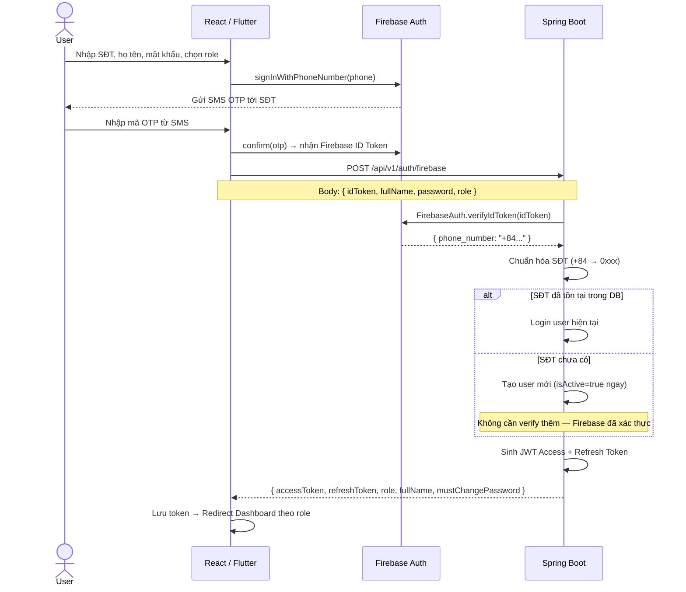
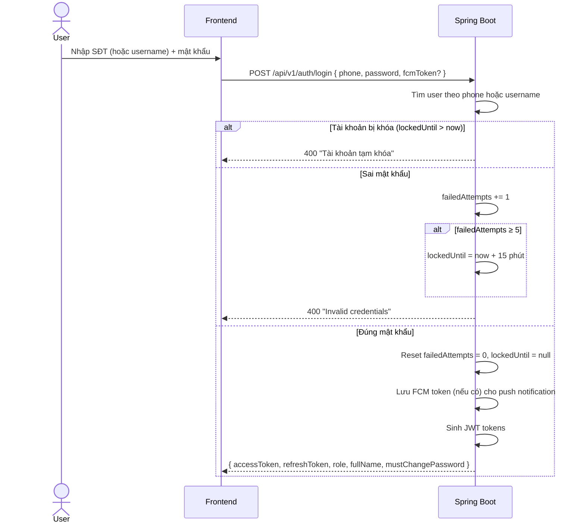
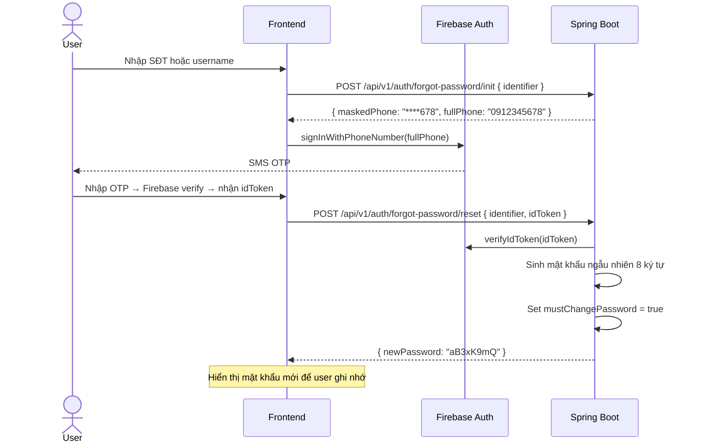
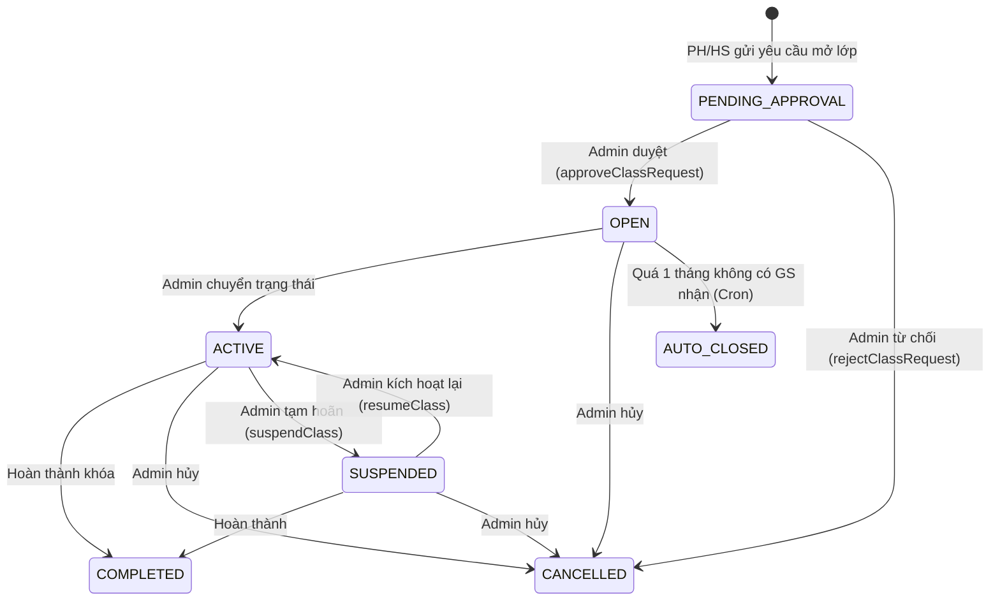
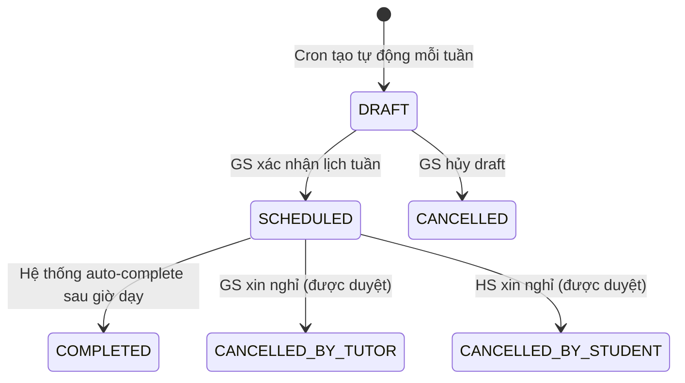
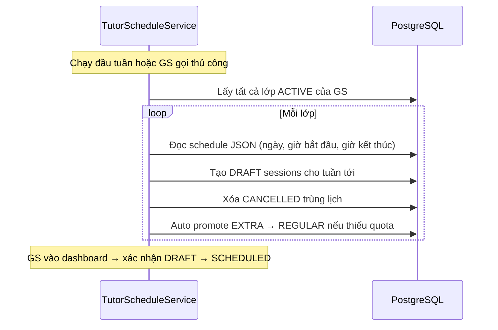
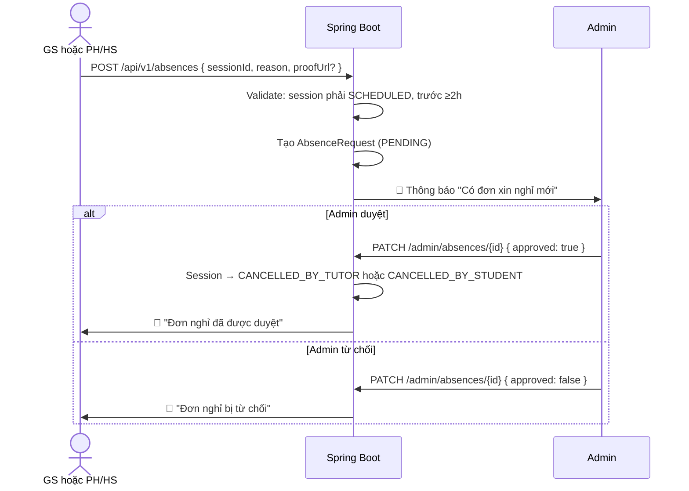
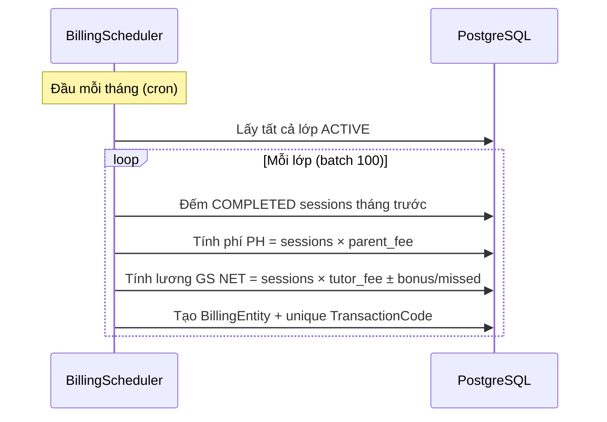
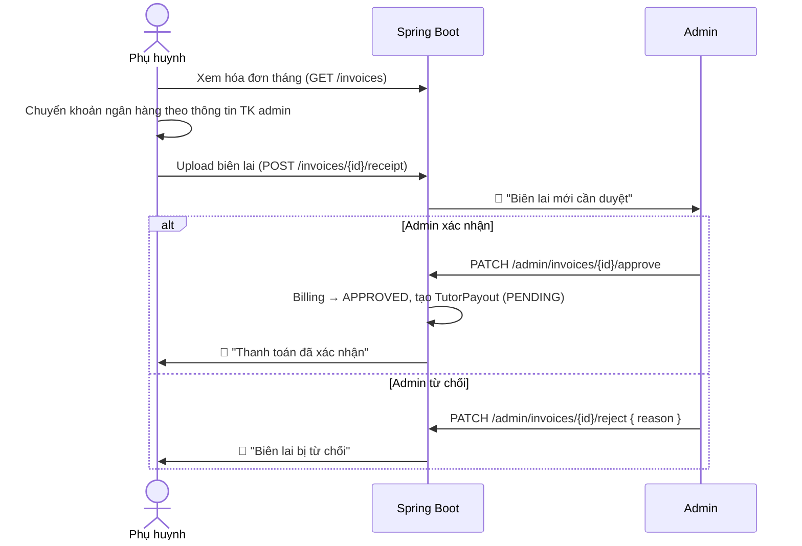
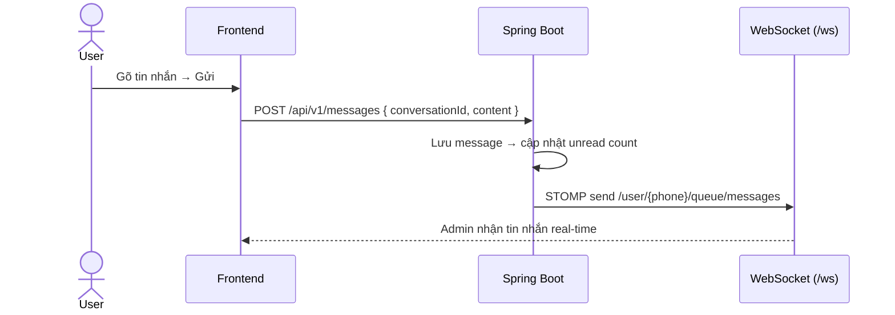

# Gia Sư Tinh Hoa — Tài liệu Nghiệp vụ

> Phiên bản: 1.2 · Cập nhật: 2026-04-10  
> Tài liệu này mô tả chi tiết các luồng nghiệp vụ **đã triển khai** trong hệ thống.

---

## 1. Đăng ký & Xác thực (Auth)

### 1.1. Đăng ký tài khoản (Firebase Phone Auth)

> **Quan trọng**: Hệ thống dùng **Firebase Phone Authentication** để xác thực OTP, KHÔNG dùng OTP tự sinh.



#### Bypass trong môi trường DEV/SIT
```
idToken = "MOCK_TOKEN_0912345678"
→ Backend tự extract phone từ token, bỏ qua Firebase verify
→ Dùng cho testing tự động, không cần SMS thật
```

### 1.2. Đăng nhập (Password-based)



### 1.3. Quên mật khẩu



### 1.4. Đổi mật khẩu

```
PUT /api/v1/auth/password (Authenticated)
Body: { oldPassword, newPassword }
→ Check oldPassword → encode newPassword → mustChangePassword = false
```

### 1.5. Refresh Token

```
POST /api/v1/auth/refresh { refreshToken }
→ Tìm token trong DB → check hết hạn → sinh cặp token mới
→ TTL: Access 1h (Admin 8h), Refresh 7 ngày (Admin 30 ngày)
```

### 1.6. Role-based Redirect

| Role | Dashboard | Ghi chú |
|------|-----------|---------|
| ADMIN | `/admin/dashboard` | Quản trị toàn bộ |
| TUTOR | `/tutor/dashboard` | Quản lý lịch dạy, doanh thu |
| PARENT | `/parent/dashboard` | Quản lý lớp con, thanh toán |
| STUDENT | `/student/dashboard` | Xem lịch học, bài tập |

---

## 2. Quản lý Lớp học (Class Lifecycle)

### 2.1. Vòng đời lớp học (thực tế đã triển khai)



### 2.2. Chi tiết từng bước

| Bước | Actor | Hành động | API | Status chuyển |
|------|-------|-----------|-----|---------------|
| 1 | **PH/HS** | Gửi yêu cầu mở lớp (môn, lớp, mode, lịch, học phí mong muốn) | `POST /api/v1/classes` | → PENDING_APPROVAL |
| 2a | **Admin** | Duyệt yêu cầu → set tiêu đề, bảng giá theo level, % phí | `PATCH /admin/classes/{id}/approve` | PENDING_APPROVAL → OPEN |
| 2b | **Admin** | Từ chối yêu cầu (kèm lý do) | `PATCH /admin/classes/{id}/reject` | PENDING_APPROVAL → CANCELLED |
| 3 | **Gia sư** | Xem lớp OPEN → Nộp đơn nhận lớp | `POST /api/v1/applications` | — |
| 4 | **Admin** | Duyệt đơn GS → GS vào danh sách đề xuất cho PH | `PATCH /applications/{id}/approve` | Application → APPROVED |
| 5 | **PH/HS** | Xem danh sách GS được đề xuất → **Chọn gia sư** | `POST /applications/{id}/select` | Gán GS vào lớp |
| 6 | **Admin** | Kích hoạt lớp → bắt đầu tạo lịch dạy | `PATCH /admin/classes/{id}/status` | OPEN → ACTIVE |

### 2.3. Tạm hoãn lớp (Suspend)

```
Admin gọi PATCH /admin/classes/{id}/suspend
Body: { reason, startDate, endDate }

Hệ thống:
1. Xóa tất cả session DRAFT/SCHEDULED trong khoảng startDate→endDate
2. Cảnh báo nếu có session COMPLETED trong khoảng
3. Chuyển lớp → SUSPENDED
4. Gửi notification cho GS, PH, và tất cả HS
5. Cron job nhắc nhở lớp SUSPENDED sắp hết hạn
```

### 2.4. Auto-close (Cron)

```
ClassExpiryScheduler chạy hàng ngày:
→ Tìm lớp OPEN có endDate < today
→ Chuyển → AUTO_CLOSED (quá 1 tháng không có GS nhận)
```

---

## 3. Quản lý Buổi học (Session)

### 3.1. Session Lifecycle



### 3.2. Loại buổi học (SessionType)

| Type | Ý nghĩa | Tính phí |
|------|---------|----------|
| **REGULAR** | Buổi chính khóa theo lịch | ✅ Tính phí PH + lương GS |
| **MAKEUP** | Buổi bù (do hủy buổi trước) | ✅ Tính phí |
| **EXTRA** | Buổi dạy thêm vượt quota | ✅ Tính phí + thưởng GS nếu vượt quota |

### 3.3. Tạo lịch tự động (Weekly Session Generator)



---

## 4. Xin nghỉ phép (Absence)

### 4.1. Luồng xin nghỉ



### 4.2. Quy tắc nghiệp vụ

- Chỉ hủy buổi có trạng thái **SCHEDULED**
- Phải xin nghỉ trước **≥ 2 tiếng**
- `make_up_required = true` → Admin sẽ sắp xếp buổi bù (MAKEUP)
- Loại đơn: `TUTOR_LEAVE` hoặc `STUDENT_LEAVE`

---

## 5. Thanh toán & Billing

### 5.1. Tạo hóa đơn tự động (BillingScheduler)



### 5.2. Luồng thanh toán PH



### 5.3. Công thức tính lương

```
Phí phụ huynh (PH)   = sessions COMPLETED × parent_fee
Phí nền tảng          = Phí PH × fee_percentage%
Lương GS (gross)      = Phí PH − Phí nền tảng  
Thưởng EXTRA          = Buổi EXTRA vượt quota × tutor_fee
Trừ nghỉ (missed)     = Buổi GS nghỉ không phép × tutor_fee
Lương GS (net)        = gross + thưởng EXTRA − trừ nghỉ
```

---

## 6. Chat & Messaging

### 6.1. Kiến trúc

- Mỗi user có **1 conversation** với Admin (hỗ trợ 1:1)
- Messages gửi qua **REST API** + broadcast qua **WebSocket STOMP**
- Unread count cập nhật real-time qua WebSocket

### 6.2. Luồng chat



### 6.3. WebSocket Channels

| Channel | Mục đích |
|---------|----------|
| `/user/{phone}/queue/messages` | Nhận tin nhắn chat mới |
| `/user/{phone}/queue/notifications` | Nhận thông báo real-time |
| `/user/{phone}/queue/notifications/unread` | Cập nhật badge chưa đọc |

---

## 7. Thông báo (Notification)

### 7.1. Kênh thông báo

| Kênh | Công nghệ | Mô tả |
|------|-----------|-------|
| **In-app** | WebSocket STOMP | Hiển thị real-time trong dropdown |
| **FCM Push** | Firebase Admin SDK | Push notification tới mobile |

### 7.2. Các loại thông báo đã triển khai

| Type | Trigger | Người nhận |
|------|---------|------------|
| `CLASS_OPENED` | Admin duyệt yêu cầu mở lớp | PH |
| `CLASS_CANCELLED` | Admin từ chối/hủy lớp | PH |
| `CLASS_SUSPENDED` | Admin tạm hoãn lớp | GS + PH + HS |
| `CLASS_RESUMED` | Admin kích hoạt lại lớp | GS + PH + HS |
| `APPLICATION_RECEIVED` | GS nộp đơn nhận lớp | Admin |
| `APPLICATION_ACCEPTED` | Admin duyệt đơn | GS |
| `APPLICATION_REJECTED` | Admin từ chối đơn | GS |
| `INVOICE_RECEIPT_UPLOADED` | PH upload biên lai | Admin |
| `INVOICE_APPROVED` | Admin duyệt thanh toán | PH |
| `INVOICE_REJECTED` | Admin từ chối biên lai | PH |
| `PAYOUT_TRANSFERRED` | Admin chuyển lương | GS |
| `SESSION_REMINDER` | Sắp đến giờ học | GS + HS |
| `MEET_LINK_SET` | GS set Google Meet link | HS |
| `ABSENCE_REQUESTED` | Xin nghỉ phép | Admin |
| `ABSENCE_APPROVED` | Duyệt đơn nghỉ | Người xin |
| `ABSENCE_REJECTED` | Từ chối đơn nghỉ | Người xin |
| `SCHEDULE_UPDATED` | GS thay đổi lịch dạy | Admin + PH |
| `SCHEDULE_CONFIRMED` | GS xác nhận lịch tuần | PH |
| `CONTACT_MESSAGE_RECEIVED` | Khách gửi form liên hệ | Admin |
| `NEW_MESSAGE` | Tin nhắn chat mới | User đối diện |

---

## 8. Khách tiềm năng & Liên hệ

### 8.1. Tư vấn nhanh (Leads)

```
Khách → Nhập tên + SĐT → "Tư vấn miễn phí"
→ POST /api/v1/leads (public, không cần login)
→ Lưu consultation_leads → Admin gọi lại
```

### 8.2. Form liên hệ (Contact Messages)

```
Khách → Trang /contact → Nhập tên, SĐT/email, chủ đề, nội dung
→ POST /api/v1/contact-messages (public)
→ Lưu contact_messages + 🔔 Thông báo tất cả Admin
→ Admin xem tại /admin/contact-messages (toggle đã đọc/chưa đọc)
```

---

## 9. Xác minh Gia sư

| Trạng thái | Ý nghĩa |
|------------|---------|
| `UNVERIFIED` | Mới đăng ký, chưa nộp hồ sơ |
| `PENDING` | Đã nộp chứng chỉ (base64), đang chờ Admin duyệt |
| `VERIFIED` | Admin đã duyệt → badge "Đã xác minh" |
| `REJECTED` | Admin từ chối → GS cần nộp lại |

---

## 10. Scheduled Jobs (Cron)

| Job | Class | Lịch | Chức năng |
|-----|-------|------|-----------|
| **ClassExpiryScheduler** | `cls/scheduler/` | Hàng ngày | OPEN quá hạn 1 tháng → AUTO_CLOSED |
| **SuspendReminderScheduler** | `cls/scheduler/` | Hàng ngày | Nhắc nhở lớp SUSPENDED sắp hết hạn |
| **BillingScheduler** | `billing/service/` | Đầu tháng | Tạo hóa đơn + TutorPayout tự động |
| **SessionAutoComplete** | — | Hàng ngày | Session quá giờ → COMPLETED |
| **WeeklySessionGenerator** | `cls/service/` | Đầu tuần | Tạo DRAFT sessions cho tuần tiếp theo |

---

## 11. Giao diện Mobile — Học sinh (STUDENT)

> **Cập nhật**: 2026-04-10
> Tài liệu này mô tả nghiệp vụ và kế hoạch giao diện Mobile (Flutter) cho role **STUDENT**.

### 11.1. Phân loại Học sinh

| Loại | Điều kiện | Ảnh hưởng nghiệp vụ |
|------|-----------|---------------------|
| **HS có PH** (liên kết) | `student_profiles.link_status = 'ACCEPTED'` | PH quản lý: thanh toán, mở lớp, chọn GS. HS chỉ xem, học, nhắn. |
| **HS độc lập** (không PH) | Không có liên kết hoặc chưa accept | HS **tự làm tất cả** như PH: mở lớp, chọn GS, thanh toán, quản lý. |

> **Nguyên tắc**: HS độc lập = PH + thêm chức năng HS. HS có PH = subset (ẩn bớt quản lý + thanh toán).

---

### 11.2. Cấu trúc Navigation (Bottom Bar — 4 tab)

| Tab | Icon | Nội dung | Ghi chú |
|-----|------|----------|---------|
| 🏠 **Trang chủ** | `home` | Dashboard, stats, lịch sắp tới, quản lý lớp | Giống PH home + section HS riêng |
| 📅 **Lịch** | `calendar` | Lịch học tháng/tuần, chi tiết buổi | Dùng chung ScheduleScreen |
| 📖 **Blog** | `article` | Blog bài viết, chia sẻ kinh nghiệm | Tab chung tất cả role |
| 📚 **Tài liệu** | `menu_book` | Tài liệu học tập theo môn/lớp | **CHỈ HS** — placeholder trước |
| 🤖 **AI** | `smart_toy` | AI hỗ trợ giải bài, gợi ý học | **CHỈ HS** — placeholder trước |
| 👤 **Tôi** | `person` | Profile, liên kết PH, cài đặt, mục quản lý | Conditional theo loại HS |

---

### 11.3. Feature Matrix — HS Mobile

| # | Tính năng | Mô tả | HS có PH | HS độc lập | Trạng thái |
|---|-----------|-------|----------|------------|------------|
| **Dashboard & Lớp học** | | | | | |
| 1 | Dashboard tổng quan | Greeting, stats, lịch sắp tới, CTA | ✅ | ✅ | 🔨 Cần bỏ mock |
| 2 | Lớp học của tôi | Danh sách lớp đang học, trạng thái | ✅ | ✅ | ✅ Đã có (home_screen) |
| 3 | Đăng ký lớp mới | PH-style: chọn môn, GS, lịch | ❌ PH làm | ✅ | ✅ Đã có (request_class_screen) |
| 4 | Xem GS ứng tuyển | Danh sách GS apply vào lớp | ❌ PH xem | ✅ | ✅ Đã có (applicants_screen) |
| **Lịch học** | | | | | |
| 5 | Lịch tháng/tuần | Calendar view, session dots | ✅ | ✅ | ✅ Đã có (schedule_screen) |
| 6 | Chi tiết buổi học | Thời gian, GS, ghi chú, trạng thái | ✅ | ✅ | ✅ Đã có |
| **Quản lý PH** | | | | | |
| 7 | Xem PH liên kết | Danh sách PH đã accept | ✅ | — | 🔨 Mock data |
| 8 | Thêm/mời PH | Input SĐT PH → gửi invite | ✅ | ✅ gợi ý | 🔨 Mock data |
| 9 | Accept/Reject PH | Banner thông báo + action | ✅ | — | 🔨 Mock data |
| **Thanh toán** | | | | | |
| 10 | Xem hóa đơn | List billings, trạng thái | ❌ PH trả | ✅ | ✅ Đã có (billings_screen) |
| 11 | Alert hóa đơn quá hạn | Banner cảnh báo | ❌ | ✅ | ✅ Đã có (home_screen) |
| **Cá nhân** | | | | | |
| 12 | Profile (avatar, info) | Edit avatar, phone, email, school, grade | ✅ | ✅ | ✅ Vừa hoàn thành |
| 13 | Đổi mật khẩu | Change password screen | ✅ | ✅ | ✅ Đã có |
| **Blog & Tài liệu** | | | | | |
| 14 | Blog bài viết | Đọc blog, chia sẻ kinh nghiệm | ✅ | ✅ | 🔨 Placeholder |
| 15 | Tài liệu học tập | Xem tài liệu theo môn | ✅ | ✅ | ⬜ LATER |
| 16 | AI hỗ trợ học | Chat AI giải bài, gợi ý | ✅ | ✅ | ⬜ LATER |
| **Giao tiếp** | | | | | |
| 17 | Chat/Nhắn tin | WebView hoặc link web | ✅ | ✅ | ⬜ LATER |
| 18 | Push notification | FCM thông báo buổi học | ✅ | ✅ | ⬜ LATER |
| **Gamification** | | | | | |
| 19 | Điểm tích lũy | Reward points từ hoàn thành buổi | ✅ | ✅ | ⬜ LATER |
| 20 | Thành tích/Badge | Streak, milestone badges | ✅ | ✅ | ⬜ LATER |

---

### 11.4. Tab "Tôi" (Profile) — Conditional theo loại HS

```
HS có PH:
├── Chỉnh sửa hồ sơ          ✅
├── PH liên kết (badge count)  ✅
├── Dashboard chi tiết → web   🔗
├── Liên hệ hỗ trợ → chat     🔗
├── Dark mode                   ✅
├── Đổi mật khẩu              ✅
└── Đăng xuất                  ✅

HS độc lập (thêm):
├── Chỉnh sửa hồ sơ           ✅
├── PH liên kết → Thêm PH      ✅ (gợi ý)
├── Dashboard chi tiết → web    🔗
├── Thanh toán học phí → web    🔗
├── Liên hệ hỗ trợ → chat      🔗
├── Dark mode                    ✅
├── Đổi mật khẩu               ✅
└── Đăng xuất                   ✅
```

---

### 11.5. Luồng UX chi tiết

#### HS độc lập (tự quản lý)

```
Login → Home
  ├── Greeting: "Chào [Tên] 🎒"
  ├── CTA: "Đăng ký lớp mới" → /request-class
  ├── Alert: GS ứng tuyển → /applicants/:classId
  ├── Alert: Hóa đơn chưa TT → /billings
  ├── 📋 Lớp học của tôi → chi tiết lớp
  ├── 📅 Lịch sắp tới → tap → chi tiết buổi
  └── ⚡ Thao tác nhanh: Tìm GS, Thanh toán, Nhắn tin

Tab Lịch → Calendar → Tap buổi → Chi tiết session

Tab Tôi → Profile + Thanh toán + PH gợi ý link
```

#### HS có PH (được quản lý)

```
Login → Home
  ├── Greeting: "Chào [Tên] 🎒" + badge PH
  ├── (KHÔNG CÓ CTA mở lớp — PH quyết) 
  ├── 📋 Lớp học của tôi (read-only)
  ├── 📅 Lịch sắp tới
  └── ⚡ Nhắn tin, Xem thành tích

Tab Lịch → Calendar → Tap → Chi tiết session
Tab Tài liệu → DS tài liệu theo môn (placeholder)
Tab AI → Chat AI giải bài (placeholder)

Tab Tôi → Profile + PH liên kết + Dashboard web + Chat
```

---

### 11.6. Backend API (đã sẵn sàng)

| Endpoint | Method | Mô tả | Ai gọi |
|----------|--------|-------|--------|
| `/api/v1/student/sessions` | GET | Lịch học theo tuần | HS |
| `/api/v1/student/parent-links` | GET | DS phụ huynh liên kết | HS |
| `/api/v1/student/parent-links` | POST | Gửi yêu cầu link (param: parentPhone) | HS |
| `/api/v1/student/parent-links/{id}/accept` | POST | Accept link từ PH | HS |
| `/api/v1/student/parent-links/{id}/reject` | POST | Reject link từ PH | HS |
| `/api/v1/students/billings` | GET | Hóa đơn (HS độc lập) | HS |
| `/api/v1/users/profile/me` | GET | Profile info | All |
| `/api/v1/users/profile` | PUT | Update profile + avatar | All |
| `/api/v1/classes/mine` | GET | DS lớp đang học | PH/HS |
| `/api/v1/classes` | POST | Tạo yêu cầu lớp (HS độc lập) | PH/HS |

---

### 11.7. Kế hoạch triển khai

| Phase | Nội dung | Ưu tiên |
|-------|----------|---------|
| **Phase 1** ✅ | Profile: avatar, phone, email, school/grade, dirty state | DONE |
| **Phase 2** 🔨 | Dashboard gọi API thực, bỏ mock. Parent Link API. Conditional nav. | NEXT |
| **Phase 3** | Blog tích hợp (chung tất cả role). Billing screen cho HS độc lập. | MEDIUM |
| **Phase 4** | Tài liệu học tập, AI hỗ trợ, Gamification, Chat, Push notification. | LATER |

