# Gia Sư Tinh Hoa — ERD Database

> Phiên bản: 1.0 · Cập nhật: 2026-04-09  
> Database: PostgreSQL 16 · Migrations: Flyway V1..V12

---

## 1. Tổng quan

Hệ thống gồm **30+ tables** phân theo nghiệp vụ:

| Nhóm | Tables | Mô tả |
|------|--------|-------|
| **Auth & Users** | `users`, `otp_codes`, `refresh_tokens`, `user_devices` | Đăng ký, xác thực, JWT |
| **Profiles** | `tutor_profiles`, `parent_profiles`, `student_profiles` | Hồ sơ theo role |
| **Class Management** | `classes`, `class_students`, `class_requests`, `class_applications`, `tutor_applications` | Lớp học, tuyển giáo viên |
| **Sessions** | `sessions`, `session_attendances`, `absence_requests` | Buổi học, điểm danh, nghỉ phép |
| **Billing** | `billings`, `invoices`, `tutor_payouts`, `payment_methods`, `admin_bank_accounts` | Thanh toán, chi trả gia sư |
| **Learning** | `assessments`, `assessment_questions`, `submissions`, `submission_answers`, `materials` | Bài kiểm tra, bài tập, tài liệu |
| **Communication** | `conversations`, `messages`, `notifications`, `notification_tokens` | Chat, thông báo |
| **Lead & Contact** | `consultation_leads`, `contact_messages` | Khách tiềm năng, form liên hệ |
| **System** | `platform_configs`, `system_settings`, `user_push_tokens` | Cấu hình hệ thống |
| **Location** | `provinces`, `wards` | Tỉnh/thành, phường/xã |

---

## 2. ERD Diagram (Mermaid)

```mermaid
erDiagram
    %% ──── AUTH & USERS ────
    users {
        uuid id PK
        varchar phone
        varchar username
        varchar password_hash
        varchar full_name
        text avatar_base64
        user_role role
        boolean is_active
        boolean is_deleted
        int failed_attempts
        timestamptz locked_until
        varchar email
        varchar address
        varchar school
        varchar grade
    }

    otp_codes {
        uuid id PK
        varchar phone
        varchar code
        varchar purpose
        uuid otp_token
        boolean is_used
        timestamptz expires_at
    }

    refresh_tokens {
        uuid id PK
        uuid user_id FK
        varchar token_hash
        timestamptz expires_at
    }

    user_devices {
        uuid id PK
        uuid user_id FK
        varchar fcm_token
        varchar device_name
    }

    user_push_tokens {
        uuid id PK
        uuid user_id FK
        varchar token
        varchar platform
    }

    %% ──── PROFILES ────
    tutor_profiles {
        uuid id PK
        uuid user_id FK
        text bio
        text_arr subjects
        varchar location
        varchar teaching_mode
        numeric hourly_rate
        numeric rating
        int rating_count
        varchar verification_status
        varchar tutor_type
        varchar id_card_number
        text_arr teaching_levels
        date date_of_birth
        int experience_years
        varchar bank_name
        varchar bank_account_number
        varchar bank_owner_name
    }

    parent_profiles {
        uuid id PK
        uuid user_id FK
        varchar address
        text note
    }

    student_profiles {
        uuid id PK
        uuid user_id FK
        uuid parent_id FK
        varchar grade
        varchar school
        varchar link_status
        varchar initiated_by
    }

    %% ──── CLASS MANAGEMENT ────
    classes {
        uuid id PK
        uuid admin_id FK
        uuid parent_id FK
        uuid tutor_id FK
        varchar title
        varchar subject
        varchar grade
        class_mode mode
        varchar address
        jsonb schedule
        int sessions_per_week
        int session_duration_min
        numeric parent_fee
        numeric tutor_fee
        numeric platform_fee
        class_status status
        date start_date
        date learning_start_date
        varchar class_code
        int fee_percentage
        varchar meet_link
    }

    class_students {
        uuid class_id FK
        uuid student_id FK
        timestamptz joined_at
    }

    class_requests {
        uuid id PK
        uuid parent_id FK
        varchar subject
        varchar grade
        class_mode mode
        varchar address
        jsonb preferred_schedule
        numeric expected_fee
        varchar status
        uuid class_id FK
    }

    class_applications {
        uuid id PK
        uuid class_id FK
        uuid tutor_id FK
        application_status status
        text note
    }

    %% ──── SESSIONS ────
    sessions {
        uuid id PK
        uuid class_id FK
        date session_date
        time start_time
        time end_time
        varchar meet_link
        session_status status
        session_type session_type
        text tutor_note
        boolean requires_makeup
        uuid makeup_for_session_id FK
    }

    session_attendances {
        uuid id PK
        uuid session_id FK
        uuid student_id FK
        boolean is_present
        text note
    }

    absence_requests {
        uuid id PK
        uuid session_id FK
        uuid requester_id FK
        text reason
        boolean make_up_required
        absence_request_status status
        absence_request_type request_type
        uuid reviewed_by FK
        text proof_url
        date makeup_date
        time makeup_time
    }

    %% ──── BILLING ────
    billings {
        uuid id PK
        uuid class_id FK
        uuid parent_id FK
        int month
        int year
        int total_sessions
        numeric parent_fee_amount
        numeric tutor_payout_amount
        varchar transaction_code
        varchar status
    }

    invoices {
        uuid id PK
        uuid class_id FK
        uuid parent_id FK
        uuid admin_bank_id FK
        numeric amount
        varchar period_label
        varchar receipt_url
        invoice_status status
    }

    tutor_payouts {
        uuid id PK
        uuid class_id FK
        uuid tutor_id FK
        uuid billing_id FK
        numeric amount
        numeric gross_amount
        numeric platform_fee
        numeric net_amount
        payout_status status
        varchar transaction_code
    }

    payment_methods {
        uuid id PK
        uuid tutor_id FK
        varchar method_type
        varchar account_number
        varchar account_name
        varchar bank_name
        boolean is_default
    }

    admin_bank_accounts {
        uuid id PK
        varchar method_type
        varchar account_number
        varchar account_name
        varchar bank_name
        boolean is_active
    }

    %% ──── LEARNING ────
    assessments {
        uuid id PK
        uuid class_id FK
        uuid created_by FK
        varchar title
        assessment_type type
        timestamptz opens_at
        timestamptz closes_at
        int duration_min
        numeric total_score
    }

    assessment_questions {
        uuid id PK
        uuid assessment_id FK
        int order_index
        question_type type
        text content
        jsonb options
        numeric score
    }

    submissions {
        uuid id PK
        uuid assessment_id FK
        uuid student_id FK
        submission_status status
        numeric total_score
        text tutor_comment
    }

    submission_answers {
        uuid id PK
        uuid submission_id FK
        uuid question_id FK
        varchar answer_mcq
        text answer_essay
        boolean is_correct
        numeric score_awarded
    }

    materials {
        uuid id PK
        uuid class_id FK
        uuid uploaded_by FK
        varchar title
        material_type type
        varchar file_url
        varchar external_url
    }

    %% ──── COMMUNICATION ────
    conversations {
        uuid id PK
        uuid user_id FK
        varchar user_role
        varchar last_message_preview
        int unread_count_admin
        int unread_count_user
        boolean is_closed
    }

    messages {
        uuid id PK
        uuid conversation_id FK
        uuid sender_id FK
        text content
        varchar message_type
        boolean is_read
    }

    notifications {
        uuid id PK
        uuid recipient_id FK
        notification_type type
        varchar title
        text body
        varchar entity_type
        uuid entity_id
        boolean is_read
    }

    %% ──── LEADS ────
    consultation_leads {
        uuid id PK
        varchar name
        varchar phone
        boolean is_contacted
    }

    contact_messages {
        uuid id PK
        varchar name
        varchar email
        varchar subject
        text message
        boolean is_read
    }

    feedbacks {
        uuid id PK
        uuid class_id FK
        uuid parent_id FK
        uuid tutor_id FK
        smallint rating
        text comment
    }

    %% ──── RELATIONSHIPS ────
    users ||--o| tutor_profiles : "has"
    users ||--o| parent_profiles : "has"
    users ||--o{ student_profiles : "has"
    users ||--o{ refresh_tokens : "has"
    users ||--o{ user_devices : "has"
    users ||--o{ user_push_tokens : "has"
    users ||--o{ notifications : "receives"
    users ||--o{ conversations : "participates"

    student_profiles }o--|| users : "parent_id"

    classes }o--|| users : "admin_id"
    classes }o--|| users : "parent_id"
    classes }o--o| users : "tutor_id"
    classes ||--o{ class_students : "has"
    classes ||--o{ sessions : "has"
    classes ||--o{ billings : "has"
    classes ||--o{ invoices : "has"
    classes ||--o{ assessments : "has"
    classes ||--o{ materials : "has"
    classes ||--o{ feedbacks : "has"
    classes ||--o{ class_applications : "has"

    class_students }o--|| users : "student_id"
    class_requests }o--|| users : "parent_id"
    class_applications }o--|| users : "tutor_id"

    sessions ||--o{ session_attendances : "has"
    sessions ||--o{ absence_requests : "has"
    session_attendances }o--|| users : "student_id"
    absence_requests }o--|| users : "requester_id"

    billings }o--|| users : "parent_id"
    invoices }o--|| users : "parent_id"
    tutor_payouts }o--|| users : "tutor_id"
    tutor_payouts }o--o| billings : "billing_id"
    payment_methods }o--|| users : "tutor_id"

    assessments ||--o{ assessment_questions : "has"
    assessments ||--o{ submissions : "has"
    submissions ||--o{ submission_answers : "has"
    submissions }o--|| users : "student_id"

    conversations ||--o{ messages : "contains"
    messages }o--|| users : "sender_id"
```

---

## 3. Custom Enum Types (PostgreSQL)

| Enum Type | Giá trị |
|-----------|---------|
| `user_role` | ADMIN, TUTOR, PARENT, STUDENT |
| `class_status` | PENDING_APPROVAL, OPEN, ASSIGNED, MATCHED, ACTIVE, COMPLETED, CANCELLED, AUTO_CLOSED |
| `class_mode` | ONLINE, OFFLINE |
| `session_status` | DRAFT, SCHEDULED, LIVE, COMPLETED, CANCELLED, COMPLETED_PENDING, CANCELLED_BY_TUTOR, CANCELLED_BY_STUDENT, DISPUTED |
| `session_type` | REGULAR, MAKEUP, EXTRA |
| `application_status` | PENDING, ACCEPTED, REJECTED, CANCELLED, APPROVED |
| `invoice_status` | PENDING, RECEIPT_UPLOADED, APPROVED, REJECTED |
| `payout_status` | PENDING, TRANSFERRED, FAILED, LOCKED, PAID_OUT |
| `absence_request_status` | PENDING, APPROVED, REJECTED |
| `absence_request_type` | TUTOR_LEAVE, STUDENT_LEAVE |
| `notification_type` | CLASS_OPENED, APPLICATION_RECEIVED, ..., CONTACT_MESSAGE_RECEIVED (26 values) |
| `assessment_type` | EXAM, HOMEWORK |
| `question_type` | MCQ, ESSAY |
| `submission_status` | DRAFT, SUBMITTED, GRADED |
| `material_type` | DOCUMENT, VIDEO, IMAGE, LINK, OTHER |

---

## 4. Flyway Migrations

| Version | Nội dung |
|---------|----------|
| V1 | Init toàn bộ schema: 30+ tables, enums, indexes, FK constraints |
| V2 | Mock data (demo) |
| V3 | Mock demo accounts (Admin, Tutor, Parent, Student) |
| V4 | System configs (platform_configs seed) |
| V5 | Bảng provinces + wards (tỉnh/phường toàn quốc) |
| V6 | Fix mock classes data |
| V7 | Tạo bảng `consultation_leads` |
| V8 | Thêm `must_change_password` column |
| V9 | Tạo bảng `user_push_tokens` |
| V10 | Thêm class SUSPENDED status |
| V11 | Thêm notification types: ABSENCE_*, SCHEDULE_* |
| V12 | Tạo bảng `contact_messages` + CONTACT_MESSAGE_RECEIVED enum |

---

## 5. Indexes quan trọng

| Table | Index | Mục đích |
|-------|-------|----------|
| `sessions` | `(class_id, session_date)` | Query buổi học theo lớp + ngày |
| `notifications` | `(recipient_id, is_read)` | Đếm unread nhanh |
| `billings` | `(class_id, month, year)` | Tìm hóa đơn theo kỳ |
| `messages` | `(conversation_id, created_at)` | Load tin nhắn mới nhất |
| `consultation_leads` | `(created_at DESC)` | Danh sách leads mới nhất |
| `contact_messages` | `(created_at DESC)`, `(is_read)` | Tin nhắn liên hệ |
