# ERD — EdTech Platform

> Generated: 2026-03-14 | DBA Agent | wf-database

## Entity Relationship Diagram

```mermaid
erDiagram
    users {
        uuid id PK
        varchar phone UK
        varchar password_hash
        varchar full_name
        user_role role
        boolean is_active
        boolean is_deleted
        timestamptz created_at
    }

    tutor_profiles {
        uuid id PK
        uuid user_id FK
        text bio
        text[] subjects
        varchar level
        varchar location
        varchar teaching_mode
        numeric hourly_rate
        numeric rating
        boolean is_verified
    }

    parent_profiles {
        uuid id PK
        uuid user_id FK
        varchar address
    }

    student_profiles {
        uuid id PK
        uuid user_id FK
        uuid parent_id FK
        varchar grade
        varchar school
    }

    platform_configs {
        uuid id PK
        varchar config_key UK
        varchar config_value
    }

    payment_methods {
        uuid id PK
        uuid tutor_id FK
        varchar method_type
        varchar account_number
        varchar account_name
        boolean is_default
    }

    admin_bank_accounts {
        uuid id PK
        varchar method_type
        varchar account_number
        varchar account_name
        boolean is_active
    }

    class_requests {
        uuid id PK
        uuid parent_id FK
        varchar subject
        varchar grade
        class_mode mode
        numeric expected_fee
        varchar status
        uuid class_id FK
    }

    classes {
        uuid id PK
        uuid admin_id FK
        uuid parent_id FK
        uuid tutor_id FK
        varchar title
        varchar subject
        class_mode mode
        jsonb schedule
        numeric parent_fee
        numeric tutor_fee
        numeric platform_fee
        class_status status
    }

    class_students {
        uuid class_id FK
        uuid student_id FK
        timestamptz joined_at
    }

    tutor_applications {
        uuid id PK
        uuid class_id FK
        uuid tutor_id FK
        text cover_note
        application_status status
    }

    sessions {
        uuid id PK
        uuid class_id FK
        date session_date
        time start_time
        time end_time
        varchar meet_link
        session_status status
    }

    session_attendances {
        uuid id PK
        uuid session_id FK
        uuid student_id FK
        boolean is_present
    }

    materials {
        uuid id PK
        uuid class_id FK
        uuid uploaded_by FK
        varchar title
        material_type type
        varchar file_url
        bigint file_size
    }

    assessments {
        uuid id PK
        uuid class_id FK
        uuid created_by FK
        varchar title
        assessment_type type
        timestamptz opens_at
        timestamptz closes_at
        numeric total_score
        varchar solution_url
        boolean is_published
    }

    assessment_questions {
        uuid id PK
        uuid assessment_id FK
        int order_index
        question_type type
        text content
        jsonb options
        numeric score
    }

    submissions {
        uuid id PK
        uuid assessment_id FK
        uuid student_id FK
        submission_status status
        numeric total_score
        timestamptz submitted_at
        timestamptz graded_at
    }

    submission_answers {
        uuid id PK
        uuid submission_id FK
        uuid question_id FK
        varchar answer_mcq
        text answer_essay
        boolean is_correct
        numeric score_awarded
    }

    invoices {
        uuid id PK
        uuid class_id FK
        uuid parent_id FK
        uuid admin_bank_id FK
        numeric amount
        varchar period_label
        varchar receipt_url
        invoice_status status
        uuid reviewed_by FK
    }

    tutor_payouts {
        uuid id PK
        uuid class_id FK
        uuid tutor_id FK
        uuid payment_method_id FK
        numeric gross_amount
        numeric platform_fee
        numeric net_amount
        payout_status status
    }

    feedbacks {
        uuid id PK
        uuid class_id FK
        uuid parent_id FK
        uuid tutor_id FK
        smallint rating
        text comment
        boolean is_visible
    }

    notifications {
        uuid id PK
        uuid recipient_id FK
        notification_type type
        varchar title
        text body
        varchar entity_type
        uuid entity_id
        boolean is_read
    }

    notification_tokens {
        uuid id PK
        uuid user_id FK
        varchar token UK
        varchar device_type
    }

    otp_codes {
        uuid id PK
        varchar phone
        varchar code
        varchar purpose
        boolean is_used
        timestamptz expires_at
    }

    refresh_tokens {
        uuid id PK
        uuid user_id FK
        varchar token_hash UK
        timestamptz expires_at
    }

    %% Relationships
    users ||--o| tutor_profiles : "has"
    users ||--o| parent_profiles : "has"
    users ||--o| student_profiles : "has"
    users ||--o{ student_profiles : "parent creates"
    users ||--o{ payment_methods : "owns"
    users ||--o{ refresh_tokens : "has"

    users ||--o{ class_requests : "parent submits"
    users ||--o{ classes : "admin creates"
    users ||--o{ classes : "parent requests"
    users ||--o{ classes : "tutor teaches"

    classes ||--o{ class_students : "enrolls"
    classes ||--o{ tutor_applications : "receives"
    classes ||--o{ sessions : "has"
    classes ||--o{ materials : "has"
    classes ||--o{ assessments : "has"
    classes ||--o{ invoices : "billed"
    classes ||--o{ tutor_payouts : "paid"
    classes ||--o{ feedbacks : "reviewed"

    sessions ||--o{ session_attendances : "records"
    assessments ||--o{ assessment_questions : "contains"
    assessments ||--o{ submissions : "answered by"
    submissions ||--o{ submission_answers : "has"

    invoices }o--|| admin_bank_accounts : "paid to"
    tutor_payouts }o--|| payment_methods : "transferred to"

    users ||--o{ notifications : "receives"
    users ||--o{ notification_tokens : "registers"
```

---

## Tables Summary

| Table | Module | Rows estimate |
|---|---|---|
| `users` | Auth | ~10k |
| `otp_codes` | Auth | ~50k (TTL cleanup) |
| `refresh_tokens` | Auth | ~30k |
| `tutor_profiles` | User | ~3k |
| `parent_profiles` | User | ~5k |
| `student_profiles` | User | ~7k |
| `platform_configs` | User | <10 |
| `payment_methods` | Payment | ~6k |
| `admin_bank_accounts` | Payment | <10 |
| `class_requests` | Class | ~5k |
| `classes` | Class | ~3k |
| `class_students` | Class | ~10k |
| `tutor_applications` | Class | ~15k |
| `sessions` | Schedule | ~50k |
| `session_attendances` | Schedule | ~150k |
| `materials` | Material | ~30k |
| `assessments` | Assessment | ~20k |
| `assessment_questions` | Assessment | ~200k |
| `submissions` | Assessment | ~80k |
| `submission_answers` | Assessment | ~1M |
| `invoices` | Payment | ~20k |
| `tutor_payouts` | Payment | ~15k |
| `feedbacks` | Feedback | ~5k |
| `notifications` | Notification | ~500k |
| `notification_tokens` | Notification | ~30k |
