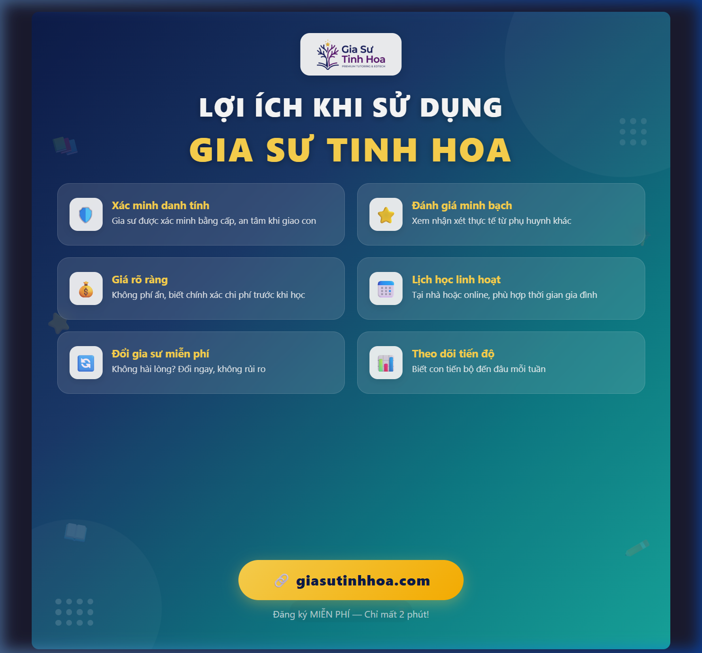

# 08 — Lợi Ích Khi Sử Dụng Gia Sư Tinh Hoa

> Dạng: Evergreen content (đăng được mọi thời điểm)
> Target: Phụ huynh + Gia sư
> Cập nhật: 2026-08-27

---

## Hình ảnh



---

## Nội dung đăng

```
💎 TẠI SAO HÀNG NGÀN PHỤ HUYNH & GIA SƯ CHỌN GIA SƯ TINH HOA? 💎

Ba mẹ ơi, tìm gia sư cho con không chỉ là "kiếm ai đó dạy"
mà là tìm ĐÚNG NGƯỜI để con tiến bộ thật sự! 🎯

━━━━━━━━━━━━━━━━━━━━

🏆 LỢI ÍCH CHO PHỤ HUYNH:

✅ Gia sư được XÁC MINH danh tính — an tâm khi giao con cho người lạ
✅ Xem ĐÁNH GIÁ minh bạch từ phụ huynh khác — không sợ "mua mèo trong bao"
✅ Giá rõ ràng, KHÔNG PHÍ ẨN — biết chính xác chi phí trước khi bắt đầu
✅ Lịch học LINH HOẠT — tại nhà hoặc online, phù hợp thời gian của gia đình
✅ Đổi gia sư MIỄN PHÍ nếu không hài lòng — 0 rủi ro cho ba mẹ
✅ Theo dõi TIẾN ĐỘ học tập — biết con tiến bộ đến đâu mỗi tuần

━━━━━━━━━━━━━━━━━━━━

🎓 LỢI ÍCH CHO GIA SƯ:

✅ Nhận lớp NHANH CHÓNG — không cần chờ đợi, không qua trung gian
✅ Tự chọn lớp PHÙ HỢP — đúng môn, đúng khu vực, đúng thời gian
✅ Thu nhập MINH BẠCH — thỏa thuận trực tiếp với phụ huynh
✅ Xây dựng UY TÍN — hồ sơ chuyên nghiệp, tích lũy đánh giá 5 sao
✅ Hỗ trợ QUẢN LÝ lịch dạy — không sợ trùng lịch hay quên buổi

━━━━━━━━━━━━━━━━━━━━

📊 CON SỐ BIẾT NÓI:

🔹 Gia sư được xác minh bằng cấp thực tế
🔹 Đánh giá trung bình từ phụ huynh luôn trên 4.5 ⭐
🔹 Phụ huynh tìm được gia sư phù hợp chỉ trong 24h
🔹 Đăng ký hoàn toàn MIỄN PHÍ cho cả hai bên

━━━━━━━━━━━━━━━━━━━━

🚀 BẮT ĐẦU CHỈ VỚI 3 BƯỚC:

1️⃣ Đăng ký tài khoản miễn phí
2️⃣ Đăng nhu cầu tìm gia sư / tạo hồ sơ gia sư
3️⃣ Kết nối & bắt đầu học ngay!

🔗 Truy cập ngay: giasutinhhoa.com
📞 Hỗ trợ 24/7 — Đăng ký chỉ mất 2 phút!

Chọn Gia Sư Tinh Hoa — chọn sự AN TÂM và CHẤT LƯỢNG! 💪✨

#GiaSuTinhHoa #LoiIchGiaSu #TimGiaSu #GiaSuGioi #PhuHuynh #GiaSuOnline #EdTech #HocThem #GiaSu1Kem1 #DayKem
```

---

## Ghi chú

- **Thời điểm đăng**: Evergreen — phù hợp mọi lúc, ưu tiên đầu tuần (Thứ 2-3)
- **Giờ đăng**: 19:30 - 21:00 (phụ huynh online) hoặc 11:30 - 13:00 (giờ nghỉ trưa)
- Bài chia 2 phần rõ ràng: lợi ích cho phụ huynh + lợi ích cho gia sư → target cả 2 nhóm
- Format liệt kê emoji ✅ → dễ scan, dễ đọc trên mobile
- CTA rõ ràng, nhắc lại quy trình 3 bước quen thuộc
- Có thể boost post với 2 ad set khác nhau (1 nhắm phụ huynh, 1 nhắm sinh viên)
- Dùng kèm với Story/Reel ngắn highlight từng lợi ích
